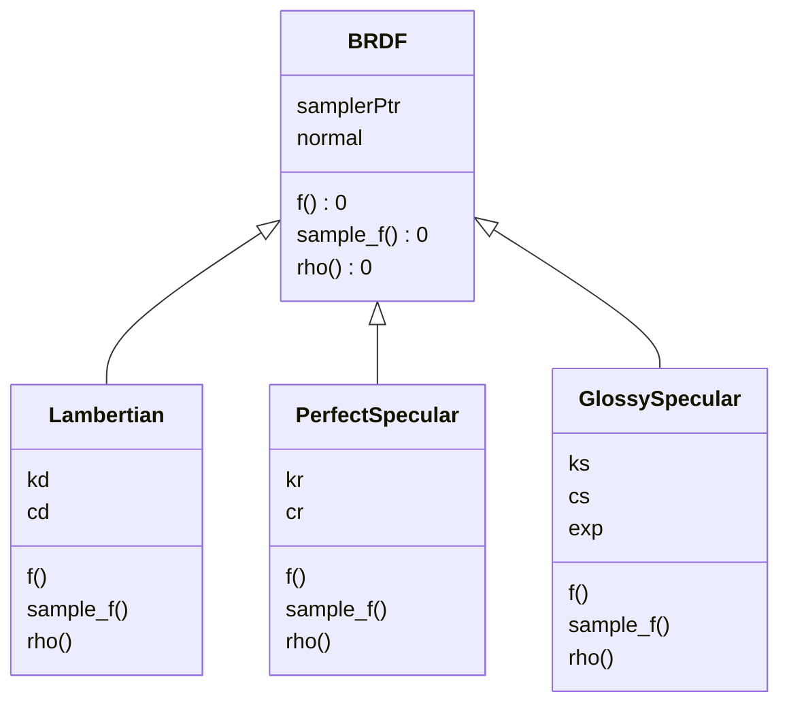

BRDF
====

```mermaid
classDiagram
class BRDF {
    samplerPtr
    normal
    f() 0
    sample_f() 0
    rho() 0
}
class Lambertian {
    kd
    cd
    f()
    sample_f()
    rho()
}
class PerfectSpecular {
    kr
    cr
    f()
    sample_f()
    rho()
}
class GlossySpecular {
    ks
    cs
    exp
    f()
    sample_f()
    rho()
}
BRDF <|-- Lambertian
BRDF <|-- PerfectSpecular
BRDF <|-- GlossySpecular
```
