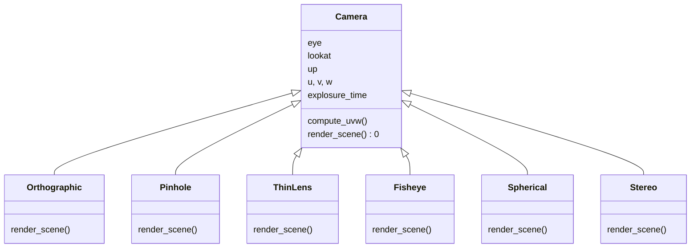

Camera
======

```mermaid
classDiagram
class Camera {
    eye
    lookat
    up
    u, v, w
    explosure_time
    compute_uvw()
    render_scene() 0
}
class Orthographic {
    render_scene()
}
class Pinhole {
    render_scene()
}
class ThinLens {
    render_scene()
}
class Fisheye {
    render_scene()
}
class Spherical {
    render_scene()
}
class Stereo {
    render_scene()
}
Camera <|-- Orthographic
Camera <|-- Pinhole
Camera <|-- ThinLens
Camera <|-- Fisheye
Camera <|-- Spherical
Camera <|-- Stereo
```
