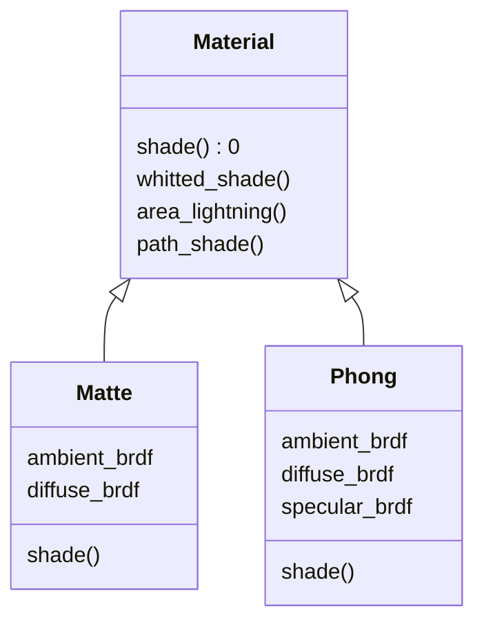

Material
========

```mermaid
classDiagram
class Material {
    shade() 0
    whitted_shade()
    area_lightning()
    path_shade()
}
class Matte {
    ambient_brdf
    diffuse_brdf
    shade()

}
class Phong {
    ambient_brdf
    diffuse_brdf
    specular_brdf
    shade()
}
Material <|-- Matte
Material <|-- Phong
```
