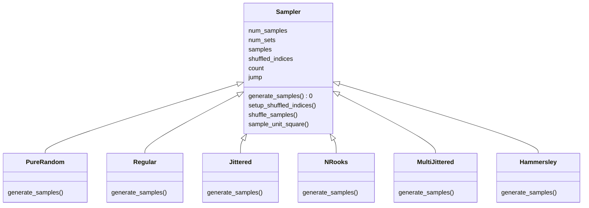

Sampler
=======

```mermaid
classDiagram
class Sampler {
    num_samples
    num_sets
    samples
    shuffled_indices
    count
    jump
    generate_samples() 0
    setup_shuffled_indices()
    shuffle_samples()
    sample_unit_square()
}
class PureRandom {
    generate_samples()
}
class Regular {
    generate_samples()
}
class Jittered {
    generate_samples()
}
class NRooks {
    generate_samples()
}
class MultiJittered {
    generate_samples()
}
class Hammersley {
    generate_samples()
}
Sampler <|-- PureRandom
Sampler <|-- Regular
Sampler <|-- Jittered
Sampler <|-- NRooks
Sampler <|-- MultiJittered
Sampler <|-- Hammersley
```
