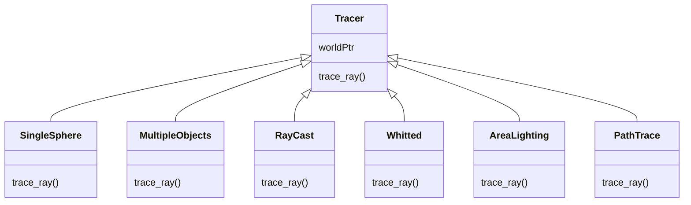

Tracers
=======

```mermaid
classDiagram
class Tracer {
    worldPtr
    trace_ray()
}
class SingleSphere {
    trace_ray()
}
class MultipleObjects {
    trace_ray()
}
class RayCast {
    trace_ray()
}
class Whitted {
    trace_ray()
}
class AreaLighting {
    trace_ray()
}
class PathTrace {
    trace_ray()
}
Tracer <|-- SingleSphere
Tracer <|-- MultipleObjects
Tracer <|-- RayCast
Tracer <|-- Whitted
Tracer <|-- AreaLighting
Tracer <|-- PathTrace
```
